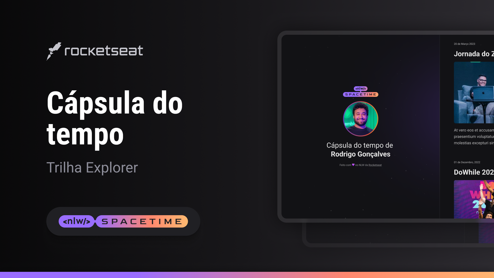

## Projeto 🖥️
Esse é um projeto Web responsivo de uma cápsula de tempo para exibir memórias em um linha do tempo.
## Tecnologias 🚀
Esse projeto foi desenvolvido durante o NLW da Rocketseat com as seguintes tecnologias:

- HTML
- CSS
- Git e Github

## Layout 🏷️
Você pode visualizar o layout do projeto através [desse link](https://www.figma.com/file/oZqBXDN4GDUTfnc6KVyw3t/C%C3%A1psula-do-tempo-%E2%80%A2-Trilha-Explorer-(Community)?type=design&node-id=306%3A84&t=lVZTH8tkjNB0yzK3-1).
É necessário ter uma conta no [Figam](https://www.figma.com)
